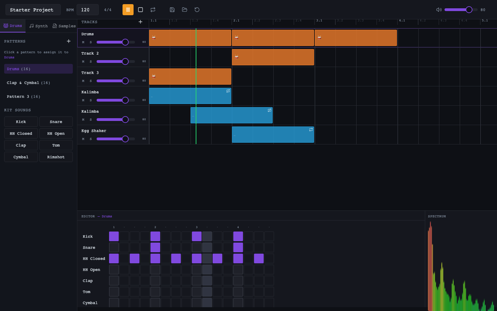
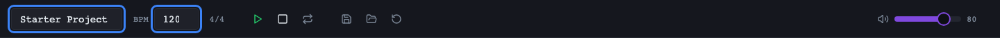
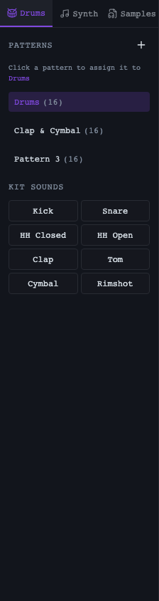
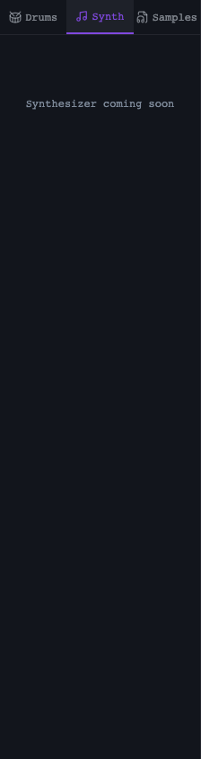
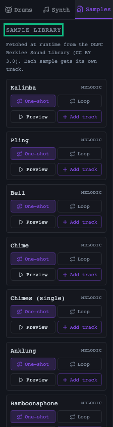
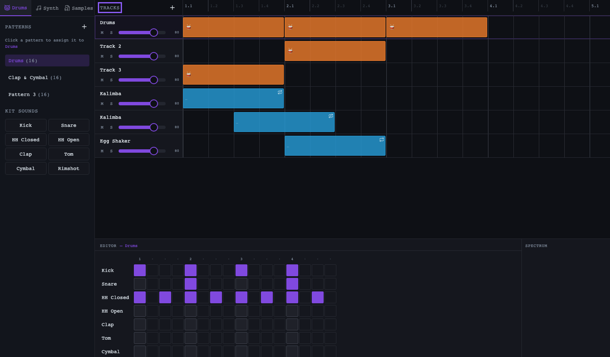
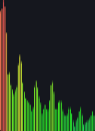

# Groove Composer — User Guide

Welcome! Groove Composer is a browser-based music composition tool. You build
patterns on a **step sequencer**, arrange them on a **timeline**, and watch the
mix in a **real-time spectrum analyzer** — all powered by the Web Audio API.

This guide tours each part of the interface and shows you how to make your
first groove.

---

## The layout at a glance

The app is split into four main areas:

| Area | What it does |
| ---- | ------------ |
| **Top bar** | Project name, BPM, time signature, transport (play/stop/loop), save/load/reset, master volume |
| **Instrument sidebar** | Three panels — **Drums**, **Synth**, **Samples** — for patterns, kit sounds, and sample tracks |
| **Timeline** | Your arrangement: tracks, clips, mute/solo, volume, and the beat ruler |
| **Editor + Spectrum** | The step sequencer for the selected pattern, plus a live spectrum analyzer |

---

## 1. Top bar

- **Project name** — click and type to rename your project.
- **BPM** — set the tempo (40–300). The transport and step sequencer follow it.
- **Time signature** — shown as `4/4` (currently fixed).
- **Transport** — ▶ play, ⏹ stop, and the **loop** toggle (🔁).
- **Save / Load / Reset** — persist your project to browser storage, load it
  back, or reset to the defaults.
- **Master volume** — the overall output level.

> 💾 Projects **autosave** to your browser's local storage, so your work
> survives a refresh.

---

## 2. Instrument sidebar

The sidebar has three tabs. The **Drums** tab is active by default.

### Drums

- **Patterns** — the list of drum patterns. Click a pattern to assign it to the
  selected track. Double-click (or use the ✏️ button) to rename it.
- **Kit Sounds** — tap any sound (Kick, Snare, HH Closed, …) to preview it.

### Synth

The synthesizer is coming soon — this panel is a placeholder for now.

### Samples

- **Sample Library** — curated, child-safe samples fetched at runtime from the
  OLPC Berklee Sound Library (CC BY 3.0).
- Each sample card lets you choose **One-shot** or **Loop**, then **Add track**
  to drop it onto the timeline as its own track.

---

## 3. Timeline

- **Tracks** — the left column lists every track. Click a track to select it.
- **+** — add a new track (with a fresh pattern).
- Each track has **M** (mute) and **S** (solo) buttons, plus a **volume** slider.
- **Clips** — drum clips show a 🥁 emoji; sample clips show a waveform and a
  **One-shot** / **Looping** badge.
- **Ruler** — the numbered grid at the top shows beats (e.g. `1.1`, `1.2`, …).
- Drag clips to move them between tracks or along the timeline.

---

## 4. Editor (step sequencer)

The editor shows the pattern for the **selected track**.

- Each row is a drum sound (Kick, Snare, HH Closed, …).
- Each column is a **step** (16 steps = one bar of 4/4).
- Click a cell to toggle it on/off. The playhead highlights the current step
  while playing.
- Click a sound name to preview it.

> 🥁 The default **Drums** pattern is a classic four-on-the-floor kick with a
> snare on beats 2 and 4 and closed hi-hats on every eighth note.

---

## 5. Spectrum analyzer

A live frequency visualization of the master output. Green bars are quieter
frequencies; they shift toward yellow and red as the level rises. It's a great
way to see your mix come alive as you play.

---

## Making your first groove

1. **Set the tempo** — type a BPM in the top bar (e.g. `120`).
2. **Build a drum pattern** — with the **Drums** track selected, click cells in
   the editor to add kick, snare, and hi-hats.
3. **Add a sample** — open the **Samples** panel, pick a sample, choose
   **Loop**, and **Add track**.
4. **Arrange** — drag clips on the timeline to build a full arrangement.
5. **Play** — hit ▶ and watch the spectrum analyzer respond.

---

## Keyboard & tips

- Projects autosave automatically — no need to hit Save constantly.
- Use **Reset project** to start fresh from the defaults.
- Mute/solo individual tracks to audition parts of your mix.

---

*Images in this guide are regenerated with `npm run regenerate:user-guide`.*
